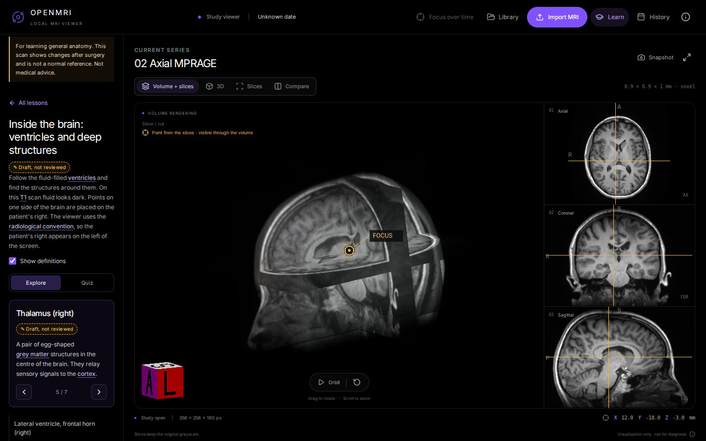
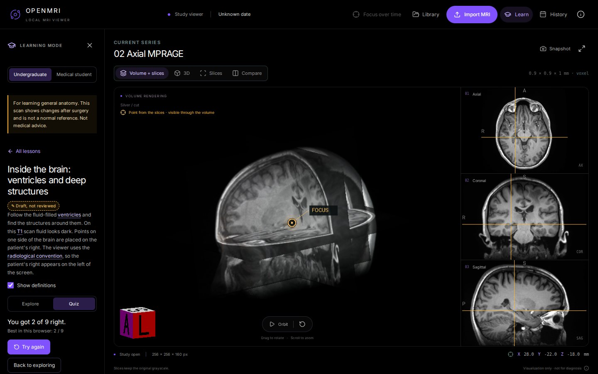
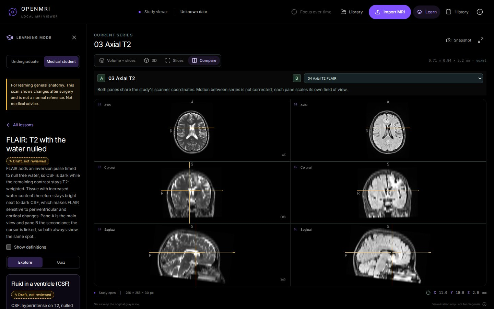

# Learning mode

A neuroanatomy and MRI teaching mode on top of the OpenMRI viewer. It uses
the demo study that ships with OpenMRI, so a student can install the app and
learn with a real 3D head MRI in minutes, entirely offline.

> **Content status: draft.** Every lesson, landmark and question is marked
> **Draft, not reviewed** until a qualified reviewer (a medical student or
> resident) has checked it. The app shows that badge on each item.

## Who it is for

One engine, two tracks. The scan and the landmark positions are shared; the
depth of the text and the quiz change.

| Track               | For                                                                          | What changes                                                                     |
| ------------------- | ---------------------------------------------------------------------------- | -------------------------------------------------------------------------------- |
| **Undergraduate**   | Intro neuroscience, psychology, anatomy & physiology, biomedical engineering | 22 landmarks and 24 questions, plain language, definitions on by default         |
| **Medical student** | Preclinical neuroanatomy, radiology electives                                | All 27 landmarks and 31 questions, anatomical detail, general clinical relevance |

## Using it

1. Start OpenMRI with the demo (`npm run demo`) and open Jane's study.
2. Click **Learn** in the header. It appears only on the demo study.
3. Choose **Undergraduate** or **Medical student**. The choice is remembered
   in this browser; switch at any time without losing your place.
4. Pick a lesson. Click a landmark, or use the arrows, and the three slices
   and the 3D marker move to it. The lesson opens its own series first.
5. Underlined words show a definition on hover or keyboard focus. **Show
   definitions** turns this on or off.
6. **Quiz** tests the lesson. For "find" questions, click the structure on a
   slice, then press **Check**. A miss moves the marker to the right place.
   Your best score per lesson is kept in this browser only.

### Lessons

| #   | Lesson                            | Tracks | Series                               |
| --- | --------------------------------- | ------ | ------------------------------------ |
| 1   | The lobes of the brain            | both   | 02 Axial MPRAGE                      |
| 2   | Ventricles and deep structures    | both   | 02 Axial MPRAGE                      |
| 3   | The brainstem                     | both   | 02 Axial MPRAGE                      |
| 4   | How MRI contrast works: T1 and T2 | both   | 02 Axial MPRAGE beside 03 Axial T2   |
| 5   | Why FLAIR hides the fluid         | both   | 03 Axial T2 beside 04 Axial T2 FLAIR |

Lessons 4 and 5 open two series side by side with a linked cursor, so the
same spot can be compared between MRI contrasts.

## What it is not

- It teaches **general anatomy**. The demo scan shows a brain after surgery
  and is **not a normal reference**; the panel says so at all times.
  Landmarks avoid the operated area, and no lesson describes this person's
  own findings.
- It does not detect, measure, or diagnose anything. Every landmark was
  placed by hand; quiz answers compare a click with that hand-placed point.
- It is not medical advice.
- Nothing leaves the computer. Scores and preferences stay in the browser.

## Accessibility

Everything works with the keyboard; focus moves to the new heading when a
view changes; definitions open on focus and close with Escape; text meets
WCAG AA contrast; right, wrong and draft states use words and symbols, not
colour alone; reduced-motion settings are respected.

## For authors and reviewers

See [AUTHORING.md](AUTHORING.md) for how to add or fix a lesson and how
review works, and [`lessons/schema.md`](../../lessons/schema.md) for every
field.

## How it was built

[PRD.md](PRD.md) holds the requirements, [PLAN.md](PLAN.md) the build plan
with its checks, and [PROGRESS.md](PROGRESS.md) the checkpoint after every
phase, including the errors the checks caught.

Learning mode is an addition to [OpenMRI](https://github.com/lev1nson/OpenMRI)
by Maksim Khuzin (MIT license).
